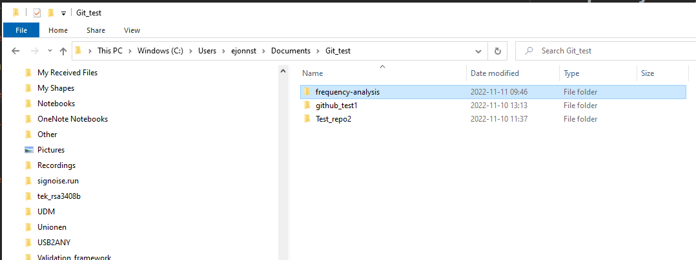

# Frequency analysis tool

The frequency analysis tool is written in Python and it uses [Stanza – A Python NLP Package for Many Human Languages](https://stanfordnlp.github.io/stanza/) in combination with [pdfplumber](https://pypi.org/project/pdfplumber/0.1.2/) to analyse and make statisistics over words in pdf-files.

The tool has a simple user-interface that will be described in relative detail below.

## Installtion in Linux or Gitbash (Windows)

Use 'cd' or other commands/methods to go to a user directory where the tool is to be installed:

### Clone git repository

> $ git clone https://github.com/jonnyGitHub57/frequency-analysis.git

### Install Stanza NLP, Google Translate Python API and Pdfplumber

Install the stanza NLP (Natural Language Processor) with:

> $ pip install stanza

Install the Google translate Python API:

> $ pip install googletransgoogletrans==3.1.0a0

Install Pdfplumber Python package to convert the text in pdf files to plain text:

> $ pip install pdfplumber

### Image

### A guide to the user interface

